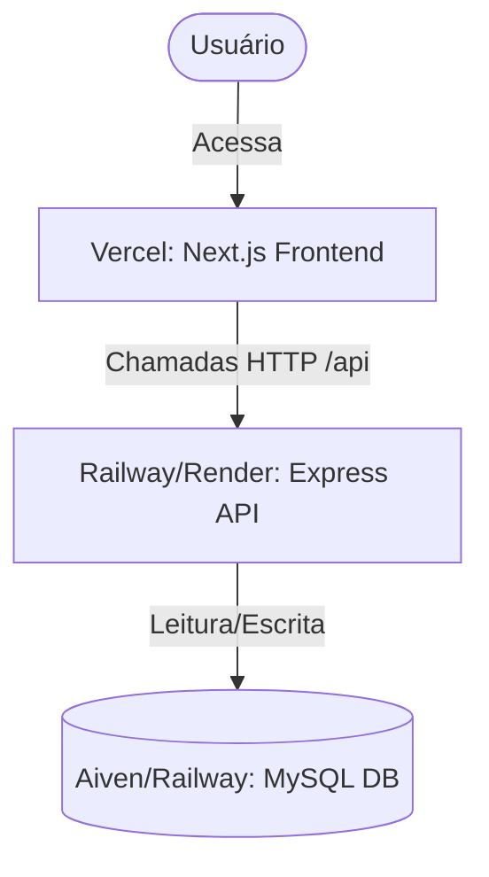

# Guia de Implantação (Deploy) — Mecâni.cão PCM 🐾

Este documento descreve o passo a passo para realizar o deploy em produção do ecossistema **Mecâni.cão PCM** no **Vercel.com** e serviços de nuvem parceiros.

Como o projeto é composto por um **Frontend em Next.js (App Router)**, um **Backend em Express (NodeJS + TypeORM)** e um banco de dados **MySQL**, o deploy exige a configuração de três partes: banco de dados, API backend e frontend.

Abaixo, apresentamos as duas principais estratégias de deploy. A **Estratégia A (Híbrida)** é a recomendada para ambientes reais de produção devido à estabilidade de conexões do MySQL e limites de execução da API.

---

## Estrutura Geral do Deploy (Estratégia Recomendada)



---

## 🚀 Estratégia A: Deploy Híbrido (Recomendada)
Nesta abordagem, o Frontend Next.js fica hospedado na **Vercel**, o banco de dados MySQL em um serviço gerenciado (como **Aiven** ou **Railway**) e o Backend Express em um servidor conteinerizado (como **Railway** ou **Render**).

### Passo 1: Configurar o Banco de Dados MySQL na Nuvem
Como a Vercel não fornece hospedagem nativa para MySQL, você precisa de um banco em nuvem.
*   **Opções recomendadas:** [Railway](https://railway.app), [Aiven](https://aiven.io) ou [Clever Cloud](https://www.clever-cloud.com).

#### Exemplo usando a Railway:
1. Acesse o painel da **Railway** e clique em **New Project**.
2. Selecione **Provision MySQL**.
3. Aguarde a criação. Vá na aba **Variables** ou **Connect** do serviço MySQL criado para obter as credenciais de acesso:
   *   `DB_HOST` (Host de conexão externa)
   *   `DB_PORT` (Porta, padrão `3306`)
   *   `DB_USER` (Usuário, ex: `root`)
   *   `DB_PASS` (Senha gerada)
   *   `DB_NAME` (Nome do banco, ex: `railway`)

---

### Passo 2: Deploy do Backend (Express API)
Como o Express é um servidor contínuo (stateful), ele deve rodar em um serviço que suporte containers Docker ou processos Node.js de longa duração.

#### Opção Recomendada: Deploy no Railway ou Render
1. Crie um novo serviço no mesmo projeto da Railway (clique em **New** > **GitHub Repo** e selecione o seu repositório).
2. Configure a pasta raiz do deploy para apontar para o diretório `/backend`. No Railway, você pode fazer isso adicionando um arquivo `watch` ou configurando a propriedade **Root Directory** nas configurações do serviço como `backend`.
3. Configure as **variáveis de ambiente (Environment Variables)** no painel do backend:
   ```env
   NODE_ENV=production
   PORT=3333
   DB_HOST=sua-url-do-mysql-provida-no-passo-1
   DB_PORT=3306
   DB_USER=root
   DB_PASS=sua-senha-do-banco
   DB_NAME=mecanicao_pcm
   JWT_SECRET=coloque-um-hash-longo-e-seguro-aqui
   JWT_EXPIRES_IN=8h
   CORS_ORIGIN=https://seu-dominio-do-frontend.vercel.app
   ```
4. **Comando de Build & Start (no painel do Render/Railway):**
   *   Build Command: `npm install && npm run build` (ou semelhante para transpilar os arquivos TypeScript em `dist/`).
   *   Start Command: `npm run migration:run && node dist/server.js`
   *   *Nota:* Para executar os seeds iniciais no banco de produção pela primeira vez, você pode rodar temporariamente em seu terminal local (apontando as variáveis de ambiente locais para o banco de dados remoto) ou executar os scripts de sementes via console da hospedagem:
     ```bash
     npx ts-node -r reflect-metadata src/seed-aprovacoes.ts
     ```

---

### Passo 3: Deploy do Frontend na Vercel
O Next.js é otimizado para a Vercel e o deploy é muito direto.

1. Acesse [vercel.com](https://vercel.com) e conecte com sua conta do GitHub.
2. Clique em **Add New...** > **Project**.
3. Importe o repositório do projeto **Mecâni.cão PCM**.
4. Nas configurações do projeto antes do deploy:
   *   **Framework Preset:** Selecione `Next.js`.
   *   **Root Directory:** Selecione a pasta `frontend` (clique em *Edit* e aponte para `frontend`).
   *   **Build & Development Settings:** Deixe os padrões (`npm run build` e `npm run start`).
   *   **Environment Variables:** Adicione a variável de ambiente para que o frontend encontre a API:
     *   `NEXT_PUBLIC_API_URL` = `https://sua-api-no-railway.up.railway.app/api` (substitua pela URL pública gerada para a sua API no Passo 2).
5. Clique em **Deploy**.
6. A Vercel construirá a aplicação e fornecerá uma URL pública (ex: `https://mecanicao-pcm.vercel.app`).
7. **Importante:** Volte no painel da API do backend e atualize a variável `CORS_ORIGIN` com a URL real gerada pela Vercel, garantindo que o backend aceite as requisições vindas do seu domínio do frontend.

---

## ⚙️ Estratégia B: Tudo na Vercel (Monorepo Serverless)
É possível colocar a API Express na Vercel como **Serverless Functions**, economizando custos de servidores externos. Contudo, há limitações importantes a considerar.

> [!WARNING]
> **Limitações do Express na Vercel:**
> 1. **Banco de Dados:** Você ainda precisará de um banco de dados MySQL externo (como Aiven ou Railway). A Vercel não hospeda bancos MySQL nativamente.
> 2. **Conexões do MySQL:** Como funções serverless iniciam e terminam a cada requisição, cada chamada cria uma nova conexão com o banco de dados. Isso pode estourar o limite de conexões do MySQL rapidamente. Recomenda-se utilizar um pooler de conexão ou um driver HTTP.
> 3. **Timeout:** Requisições demoradas (como geração de relatórios BI complexos ou carregamento inicial de sementes) podem estourar o limite padrão de 10 segundos de execução de funções serverless em contas gratuitas da Vercel.

### Passo 1: Configurar a API como Serverless
Para fazer o Express rodar no ambiente Serverless da Vercel, precisamos adicionar um arquivo de configuração na raiz do projeto ou adaptar a estrutura de pastas.

1. Crie um arquivo `vercel.json` na raiz do seu repositório:
   ```json
   {
     "version": 2,
     "builds": [
       {
         "src": "frontend/package.json",
         "use": "@vercel/next"
       },
       {
         "src": "backend/src/server.ts",
         "use": "@vercel/node"
       }
     ],
     "routes": [
       {
         "src": "/api/(.*)",
         "dest": "backend/src/server.ts"
       },
       {
         "src": "/(.*)",
         "dest": "frontend/$1"
       }
     ]
   }
   ```
2. Adapte o ponto de entrada da API (`backend/src/server.ts`) para exportar a aplicação Express (geralmente usando `module.exports = app` ou `export default app` ao invés de apenas rodar `app.listen(PORT)`), permitindo que a Vercel encapsule a rota Express como uma Serverless Function.

### Passo 2: Rodar as Migrations e Seeds
Como funções serverless não possuem terminal persistente para rodar `npm run migration:run` no deploy:
1. Configure as variáveis de ambiente locais apontando para o seu banco MySQL de produção.
2. Rode as migrations e seeds a partir da sua própria máquina de desenvolvimento voltada para o banco de produção:
   ```bash
   # Rodando do terminal local para criar as tabelas no banco de produção
   DB_HOST=url-do-banco-de-producao.com DB_USER=admin DB_PASS=senha npm run migration:run
   ```

### Passo 3: Deploy na Vercel
1. No painel da Vercel, importe a raiz do projeto (não selecione a subpasta `/frontend` como diretório raiz neste caso, deixe na raiz do repositório para ler o arquivo `vercel.json` configurado).
2. Configure as variáveis de ambiente globais do projeto (disponibilizadas para ambas as aplicações):
   *   `DB_HOST`, `DB_PORT`, `DB_USER`, `DB_PASS`, `DB_NAME` (Credenciais do MySQL de produção).
   *   `JWT_SECRET` (Chave de criptografia).
   *   `NEXT_PUBLIC_API_URL` = `/api` (Como ambos rodam no mesmo domínio sob o arquivo `vercel.json`, o frontend pode chamar `/api` de forma relativa).
3. Clique em **Deploy**.

---

## 📝 Lista de Variáveis de Ambiente Necessárias (Checklist)

### No Backend (API):
*   `DB_HOST` — Host do servidor MySQL na nuvem.
*   `DB_PORT` — Porta do MySQL (geralmente `3306`).
*   `DB_USER` — Usuário do banco de dados.
*   `DB_PASS` — Senha do usuário do banco de dados.
*   `DB_NAME` — Nome do banco de dados criado.
*   `JWT_SECRET` — Chave secreta para criptografia de tokens JWT.
*   `JWT_EXPIRES_IN` — Tempo de expiração dos tokens (recomendado `8h`).
*   `PORT` — Porta onde o Express roda (geralmente setada automaticamente pela hospedagem).
*   `CORS_ORIGIN` — URL exata do frontend (ex: `https://mecanicao.vercel.app`).

### No Frontend (Vercel):
*   `NEXT_PUBLIC_API_URL` — Endereço URL público da API Express (ex: `https://mecanicao-api.railway.app/api` ou `/api` caso utilize a Estratégia B).
